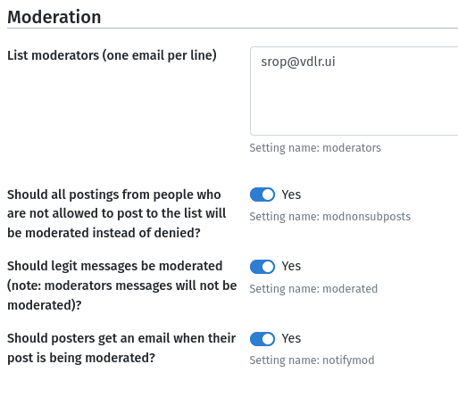

<!--
Ohart ongi: README hau automatikoki sortu da <https://github.com/YunoHost/apps/tree/master/tools/readme_generator>ri esker
EZ editatu eskuz.
-->

# Mailing List Manager YunoHost-erako

[](https://ci-apps.yunohost.org/ci/apps/mlmmj/)  

[](https://install-app.yunohost.org/?app=mlmmj)

*[Irakurri README hau beste hizkuntzatan.](./ALL_README.md)*

> *Pakete honek Mailing List Manager YunoHost zerbitzari batean azkar eta zailtasunik gabe instalatzea ahalbidetzen dizu.*  
> *YunoHost ez baduzu, kontsultatu [gida](https://yunohost.org/install) nola instalatu ikasteko.*

## Aurreikuspena

MLMMJ is a mailing list manager notable for its low memory and CPU footprint, requiring no database. Designed to be file-managed, MLMMJ lacks a native graphical interface, though independent graphical interfaces do exist.

In this YunoHost app, a configuration panel is provided in the webadmin (in the app's info page) and allows to configure settings such as:
- Subscription and posting policy
- Moderation options
- Customization of email subjects and footers.
- Add or remove subscribers


**Paketatutako bertsioa:** 1.4.3~ynh1

## Pantaila-argazkiak



## Dokumentazioa eta baliabideak

- Aplikazioaren webgune ofiziala: <https://mlmmj.org/>
- Administratzaileen dokumentazio ofiziala: <https://mlmmj.org/README.html>
- Jatorrizko aplikazioaren kode-gordailua: <https://codeberg.org/mlmmj/mlmmj>
- YunoHost Denda: <https://apps.yunohost.org/app/mlmmj>
- Eman errore baten berri: <https://github.com/YunoHost-Apps/mlmmj_ynh/issues>

## Garatzaileentzako informazioa

Bidali `pull request`a [`testing` abarrera](https://github.com/YunoHost-Apps/mlmmj_ynh/tree/testing).

`testing` abarra probatzeko, ondorengoa egin:

```bash
sudo yunohost app install https://github.com/YunoHost-Apps/mlmmj_ynh/tree/testing --debug
edo
sudo yunohost app upgrade mlmmj -u https://github.com/YunoHost-Apps/mlmmj_ynh/tree/testing --debug
```

**Informazio gehiago aplikazioaren paketatzeari buruz:** <https://yunohost.org/packaging_apps>
